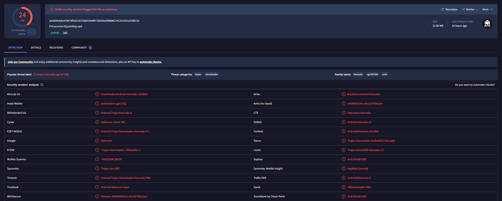
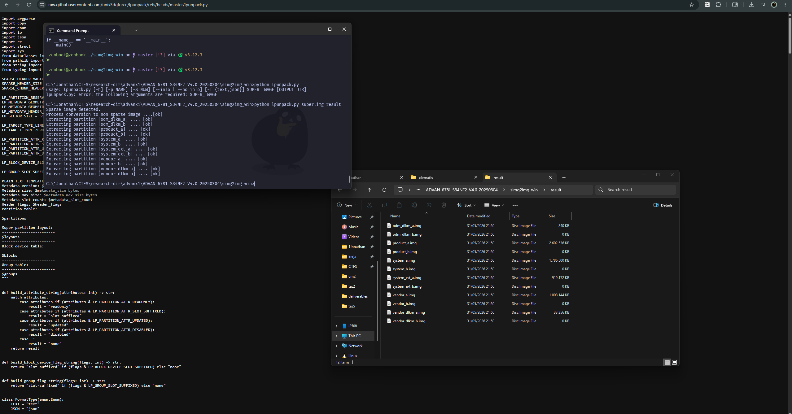

**TL;DR**: I pulled the stock firmware of an Advan X1 budget Android phone, extracted the default launcher from `super.img`, and found embedded SDK code capable of downloading and executing remote `.dex` files, running shell commands, and silently installing APKs, all baked into the home screen launcher that ships with the device.

---

## Introduction

Budget Android phones are everywhere. Across South East Asia, Africa, and Latin America, they are often a person's first and only smartphone. Users generally trust what comes out of the box, and that trust is rarely questioned.

During a routine firmware analysis of the **Advan X1** (`ADVAN_6781_S34NF2_V4.0_20250304`), a budget Android device by the Indonesian brand Advan, I took a closer look at the default launcher. The device ships with firmware that appears to originate from **Shenzhen Prize (SZPrize)**, a Chinese ODM (Original Design Manufacturer) known for providing white-label Android builds to various budget phone brands.

The default launcher, `PriLauncher3QuickStep`, is based on AOSP's Launcher3, but comes bundled with additional SDKs under the `com.hs.p.*` and `com.hs.cld.*` namespaces. These aren't part of the standard Android launcher codebase, and their behavior is worth examining closely.

VirusTotal flags the APK with [multiple detections](https://www.virustotal.com/gui/file/a5d594c8de979074f2d22b37bb01b04fd738295a9388862141252201e028813e). This post walks through what I found when I looked at why.



---

## Methodology

The firmware image `ADVAN_6781_S34NF2_V4.0_20250304` was obtained as a stock ROM package. The analysis was performed as follows:

1. **`super.img`** was unpacked using [`lpunpack`](https://raw.githubusercontent.com/unix3dgforce/lpunpack/refs/heads/master/lpunpack.py) to extract the logical partitions (`system`, `vendor`, `product`, `system_ext`).
2. The extracted `system_ext` partition was explored using **ext2explore** to locate the launcher APK at:
   ```
   /system_ext/priv-app/PriLauncher3QuickStep/PriLauncher3QuickStep.apk
   ```
3. The APK's `classes2.dex` was decompiled using **JADX** for static analysis.
4. Strings were bulk-extracted from the DEX binary for pattern analysis.

A public firmware dump of this same device is [available on GitHub](https://github.com/DumpsVaults/advan_advan_x1_dump/blob/ADVAN_X1-user-14-UP1A.231005.007-1741073556-release-keys/system_ext/priv-app/PriLauncher3QuickStep/PriLauncher3QuickStep.apk) for independent verification.

**A note on scope:** This analysis is based on static analysis of decompiled code and extracted strings. I did not perform dynamic analysis on a live device, so behavioral claims are inferred from the code rather than observed at runtime. Where I make inferences, I'll try to be explicit about it.



---

## Finding 1: A General-Purpose Shell Execution Wrapper

Located in `com.hs.cld.ds.ApkUtils`, the launcher contains a method that wraps `ProcessBuilder` to execute arbitrary commands:

```java
// com.hs.cld.ds.ApkUtils
private static CmdResult exeCmdArgs(String[] strArr) throws Exception {
    Process processStart;
    // ...
    try {
        processStart = new ProcessBuilder(strArr).start();
        // captures both stdout and stderr
        byteArrayOutputStream = new ByteArrayOutputStream();
        errorStream = processStart.getErrorStream();
        IoUtils.write(errorStream, byteArrayOutputStream);
        byteArrayOutputStream2 = new ByteArrayOutputStream();
        inputStream = processStart.getInputStream();
        IoUtils.write(inputStream, byteArrayOutputStream2);
        CmdResult cmdResult = new CmdResult(
            byteArrayOutputStream.toString("UTF-8"),   // stderr
            byteArrayOutputStream2.toString("UTF-8")   // stdout
        );
        // ...
        return cmdResult;
    }
    // ...
}
```

The method accepts an arbitrary `String[]` command array, executes it, captures both stdout and stderr, and returns the result in a `CmdResult` wrapper. The same class also exposes `installByCmd` and `uninstallByCmd` methods, the naming strongly suggests these invoke `pm install` / `pm uninstall` via the shell.

Since the APK is located in `priv-app/`, it's treated by Android as a privileged system application. This typically grants it a broader set of permissions than a user-installed app would receive, though the exact privilege level also depends on the app's declared UID, its platform signature status, and the device's SELinux policy. What we can say is that commands executed through this wrapper would run under the launcher's process identity, which, given its `priv-app` placement, is likely more permissioned than a typical third-party app.

---

## Finding 2: A Remote Code Loading Framework

The component that stands out the most is `com.hs.p.dx.DexUtils`, a plugin loading framework built around Android's `DexClassLoader`:

```java
// com.hs.p.dx.DexUtils
public static String callInit(Context context, Invocation invocation) throws Exception {
    // Validates that a local .dex file exists
    if (invocation.mLocalDexFile == null) throw new Exception("dex object not found");
    if (!invocation.mLocalDexFile.exists()) throw new Exception("dex file not found");

    String absolutePath = invocation.mLocalDexFile.getAbsolutePath();
    String localDexOutputDir = getLocalDexOutputDir(invocation.mLocalDexFile);

    // Creates a DexClassLoader and invokes the target method
    return invokeInitMethod(context,
        new DexClassLoader(absolutePath, localDexOutputDir, null, context.getClassLoader()),
        invocation, absolutePath, localDexOutputDir);
}
```

The `Invocation` object acts as a descriptor for what to load and execute. Based on the decompiled fields, it contains:
- **`mLocalDexFile`**, the `.dex` file on disk to load
- **`mLocalDexFileUrl`**, a URL field, suggesting the file can be fetched remotely
- **`mClassName`**, the fully-qualified class to load from the `.dex`
- **`mInitMethod`** / **`mUninitMethod`**, lifecycle methods to invoke on that class
- **`mInvocationCipher`**, a field name that implies the invocation payload may be encrypted or obfuscated in transit

The framework also creates a custom `PluginContext` for each loaded module, using reflection to inject a separate `AssetManager` and `Resources` instance:

```java
private static Context createPluginContext(Context context, String str) {
    AssetManager assetManager = (AssetManager) AssetManager.class.newInstance();
    assetManager.getClass().getMethod("addAssetPath", String.class)
        .invoke(assetManager, str);  // load plugin's resources
    ensureStringBlocks(assetManager);
    Resources resources2 = new Resources(assetManager,
        resources.getDisplayMetrics(), resources.getConfiguration());
    return new PluginContext(context.getApplicationContext(),
        resources2, assetManager, resources2.newTheme(), context.getClassLoader());
}
```

This means a loaded plugin can bring its own UI elements, layouts, strings, and drawables, it's not just executing logic, it can render a full interface. Combined with the `mLocalDexFileUrl` field and the download infrastructure described in Finding 3, the implication is that this framework is designed to load code that wasn't originally on the device.

To be clear: `DexClassLoader` itself is a legitimate Android API, and some apps use it for valid purposes like modular feature delivery. But the presence of remote URL fields, an encryption layer, and the fact that this lives inside a home screen launcher, which users cannot easily replace or disable, makes the context here considerably more concerning than a typical plugin system.

---

## Finding 3: A Silent Installation Pipeline

String analysis reveals a set of method and class names that outline a silent app installation workflow. The central data class appears to be `PullSilentEven` (the typo is in the original source):

| String | What it suggests |
|--------|------------------|
| `silentInstall` | App installation without explicit user interaction |
| `silentDownload` | Background payload downloads |
| `installByCmd` | APK installation via shell command |
| `uninstallByCmd` | APK removal via shell command |
| `anyhow-install` | Force-install path, possibly bypassing preconditions |
| `wait.install.result` | Blocks until installation completes |
| `onSilentInstallPush` | Triggered by a push event |
| `isScreenLocked` | Screen lock state check |
| `KEY_SILENT_TO` | Likely a timeout value for silent operations |
| `PullSilentEven{planId=` | Server-assigned identifier for batch operations |

One log message from `ServiceUtil` is particularly telling:

```
ServiceUtil getSilentMsg  CommonUtils.isScreenLocked(service):
```

This indicates the code checks whether the device screen is locked before proceeding with silent operations. The most straightforward interpretation is that the system is designed to perform installations when the user is not actively looking at the phone, though without dynamic analysis, I can't confirm the exact conditional logic surrounding this check.

The `planId` field in `PullSilentEven` and related classes like `PullMessager` suggests a server-side orchestration model, a backend can define "plans" that get pushed to devices, potentially coordinating batch app installations or plugin deployments across a fleet.

---

## Finding 4: Hardcoded Remote Endpoints

The DEX file contains two hardcoded domains associated with SZPrize:

| URL | Likely purpose |
|-----|----------------|
| `http://launcher.szprize.cn` | Launcher configuration or command endpoint |
| `https://unity.hwprize.com/` | Ad/monetization SDK endpoint |

The first URL uses **plain HTTP**, no TLS. If the launcher communicates with this endpoint for configuration, plugin URLs, or installation plans, that traffic is susceptible to interception and modification by anyone in a network-level position (e.g., shared WiFi, compromised ISP, etc.). In a worst case, a MitM attacker could substitute a legitimate response with one pointing to a malicious `.dex` payload.

There's also a practical long-term risk: if `szprize.cn` subdomains are ever abandoned and re-registered by a third party, any devices still polling those endpoints would begin talking to an attacker-controlled server. This isn't a theoretical concern, domain takeover of abandoned infrastructure has been documented in [prior research](https://www.techradar.com/pro/security/researchers-hijack-thousands-of-backdoors-thanks-to-expired-domains).

An additional embedded string, `0a14fc502731prizecce34`, may be a hardcoded API key or device group identifier, though its exact purpose wasn't confirmed.

---

## Finding 5: The `com.hs` SDK Ecosystem

The capabilities described above are not part of AOSP's Launcher3. They come from a set of SDKs bundled under the `com.hs` and `com.pri` namespaces:

| Package | Apparent role |
|---------|---------------|
| `com.hs.cld.ds` | Download management, APK installation, shell command execution |
| `com.hs.p.dx` | Dynamic DEX loading, plugin lifecycle (`DexUtils`, `Invocation`, `PluginContext`) |
| `com.hs.p.common.utils` | Shared utilities (logging, text handling) |
| `com.hs.p.cldlib` | Core library with its own resources and config |
| `com.hs.p.qlib` | UI components (layouts, drawables, likely for ad rendering) |
| `com.pri.app.beans` | Data models for push events (`PullSilentEven`, `PullMessager`, `PullToastAD`, `DeepLinkTable`) |

The `PullToastAD` and `DeepLinkTable` beans suggest the SDK also handles ad delivery, pushing toast-style notifications and deep-linking users to apps like `com.prize.browser` and `com.prize.inforstream`.

---

## Putting It Together

Based on the code and string evidence, the following flow appears to be possible:

```
┌─────────────────────────────────────────────────────────────────┐
│                     Remote Server                               │
│              http://launcher.szprize.cn (HTTP)                  │
└──────────────────────────┬──────────────────────────────────────┘
                           │  Pushes a "plan" containing:
                           │  - DEX URL + class name + method
                           │  - APK download URL
                           │  - Silent install flags
                           ▼
┌─────────────────────────────────────────────────────────────────┐
│              PriLauncher3QuickStep (priv-app)                    │
│                                                                 │
│  1. PullSilentEven receives push → parseInvocation()            │
│  2. Checks isScreenLocked() → waits for user inactivity         │
│  3. silentDownload() → fetches .dex or .apk from remote URL     │
│  4. DexUtils.callInit() → DexClassLoader loads + runs code      │
│  5. installByCmd() → pm install via ProcessBuilder              │
└─────────────────────────────────────────────────────────────────┘
```

I want to be clear that this is a reconstructed flow based on static analysis, I'm connecting the dots between class names, method signatures, string references, and code paths. I haven't intercepted live traffic or triggered this pipeline on a running device. But the pieces fit together in a way that's hard to interpret benignly.

---

## The Gray Area

So is this malware? It depends on where you draw the line.

The code was almost certainly placed here **intentionally** by the firmware supplier for monetization, pushing ads, pre-installing sponsored apps, and delivering content to devices. From the manufacturer's perspective, this is a revenue feature.

From a security standpoint, the *capabilities* present in this code overlap significantly with what you'd see in a Trojan Downloader:

| Capability | Present? | Notes |
|------------|----------|-------|
| Download and execute remote code | Yes | `DexClassLoader` + `mLocalDexFileUrl` |
| Execute shell commands | Yes | `ProcessBuilder` in `exeCmdArgs` |
| Silent app install/uninstall | Yes | `installByCmd` / `uninstallByCmd` |
| Screen lock awareness | Yes | `isScreenLocked` check |
| Remote command endpoint | Yes | `http://launcher.szprize.cn` (plain HTTP) |
| User cannot easily remove it | Yes | `priv-app/` system app |
| Obfuscated payloads | Likely | `mInvocationCipher` field |

The critical distinction is **intent**. As shipped, this is probably being used for aggressive ad monetization and bloatware distribution, behavior that's ethically questionable but common in the budget phone market.

The problem is that intent is not a technical control. The same infrastructure that pushes an ad SDK today could push something far worse tomorrow, whether through a compromised server, a rogue insider, an expired domain, or a supply chain breach. The capabilities are already in place; only the payload would need to change.

This is why VirusTotal flags it. Not necessarily because it's *doing* something malicious right now, but because the machinery it ships with is indistinguishable from what a threat actor would build.

---

## Affected Devices

This analysis focused on the **Advan X1** (`ADVAN_6781_S34NF2_V4.0_20250304`), but the `com.hs` SDK and SZPrize firmware stack appear across multiple budget Android brands. Any device shipping `PriLauncher3QuickStep` with the `com.hs.p.*` / `com.hs.cld.*` packages likely contains the same code. The exact scope would require surveying firmware dumps across other SZPrize-derived devices.

---

## Recommendations

**For users of affected devices:**
- Replace the default launcher with an open-source alternative (e.g., Lawnchair, KISS Launcher). You can disable the stock launcher via ADB:
  ```bash
  adb shell pm disable-user --user 0 com.android.launcher3
  ```
- Use a DNS-level blocker (e.g., NextDNS, AdGuard) to block `*.szprize.cn` and `*.hwprize.com`
- If a custom ROM is available for your device, consider flashing it to remove the stock firmware entirely

**For the security community:**
- The SZPrize firmware supply chain warrants broader investigation: other devices using the same ODM base should be examined
- Firmware dumps can be scanned for `com.hs.cld` and `com.hs.p.dx` package references as a quick triage
- The `launcher.szprize.cn` domain should be monitored for registration changes

---

## Indicators of Compromise (IOCs)

| Type | Value |
|------|-------|
| **Package** | `com.hs.cld.ds` |
| **Package** | `com.hs.p.dx` |
| **Package** | `com.hs.p.cldlib` |
| **Package** | `com.hs.p.qlib` |
| **Package** | `com.pri.app.beans` |
| **Domain** | `launcher.szprize.cn` |
| **Domain** | `unity.hwprize.com` |
| **Embedded string** | `0a14fc502731prizecce34` |
| **APK** | `PriLauncher3QuickStep.apk` |
| **SHA256** | `a5d594c8de979074f2d22b37bb01b04fd738295a9388862141252201e028813e` |
| **Class** | `com.hs.p.dx.DexUtils` |
| **Class** | `com.hs.cld.ds.ApkUtils` |
| **Method** | `exeCmdArgs` |
| **Method** | `installByCmd` / `uninstallByCmd` |
| **Method** | `silentInstall` / `silentDownload` |

---

## Tools Used

- [lpunpack](https://github.com/unix3dgforce/lpunpack): `super.img` dynamic partition extractor
- [ext2explore](https://sourceforge.net/projects/ext2read/): ext4 filesystem image browser on Windows
- [JADX](https://github.com/skylot/jadx): DEX bytecode to readable Java decompiler
- [VirusTotal](https://www.virustotal.com/): malware analysis platform

---

*This research was conducted independently for educational and security awareness purposes. All findings are based on static analysis of publicly available firmware. If you are a manufacturer or vendor affected by these findings, I welcome responsible discussion.*
