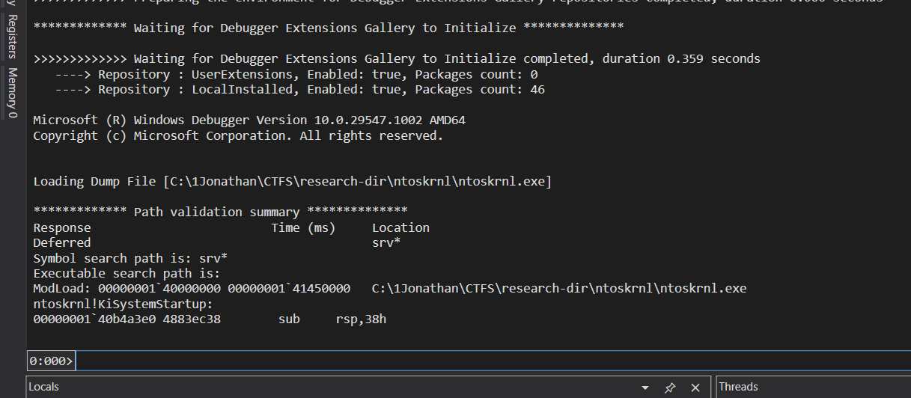

So a while back, while designing the "sandboxed debugging" challenge for **Cyber Jawara National 2024 Final**, I deliberately wrote the writeup with a line that said something like *"Traditional tools like Volatility won't work due to symbol mismatches, so we'll rely on MemProcFS, a hex editor, and WinDbg."*

I never actually proved *why* it wouldn't work, I just knew it from testing it once and watching it explode. Recently I went back and actually debugged the whole thing properly, mostly out of curiosity (and a little bit of "wait, can I actually fix this?"). Turns out the rabbit hole goes way deeper than just symbols. Writing this down before I forget.

---

## Intros

Windows Sandbox (WDAG, Windows Defender Application Guard's lightweight cousin) is a disposable, Hyper-V-isolated environment. Every time you boot it, you get a fresh container running its own little kernel instance. If you dump its memory and throw it at Volatility 3, you'd expect it to behave like any other Windows memory image, right?

Wrong. Vol3 chokes on it almost immediately:

```
Unsatisfied requirement plugins.PsList.kernel.layer_name:
Unsatisfied requirement plugins.PsList.kernel.symbol_table_name:
```

Two unsatisfied requirements at once. That's your first clue this isn't a one-layer problem.

## Problem #1: the PDB doesn't exist on the public symbol server

Volatility 3 needs an ISF (Intermediate Symbol File, a JSON blob) to know how to interpret kernel structures like `_EPROCESS` and `_ETHREAD`. If it doesn't have one cached, it tries to auto-fetch the matching PDB from Microsoft's symbol server (MSDL) using the kernel's GUID + Age, then convert it on the fly.

For Sandbox, that lookup just 404s. The kernel build running inside WDAG is often a micro-patch level that Microsoft never published symbols for publicly. No PDB, no ISF, no auto-magic.

Workaround: WinDbg, when pointed at a live or dumped kernel, can resolve and cache the PDB itself even when the bare MSDL URL 404s (somehow it's more persistent / has better fallback logic). So the move is:

```
!sym noisy
.reload /f ntoskrnl.exe
lmv m ntoskrnl
```



That last command spits out the local cache path to the actual `.pdb` file WinDbg pulled down. Grab that file.

## Problem #2: converting PDB to ISF

I briefly (and wrongly) tried `dwarf2json`, which only outputs `linux` or `mac` ISFs, DWARF is a Unix debug format, completely irrelevant for PE/PDB. The actual tool is `pdbconv.py`, bundled inside Volatility 3's own source (`volatility3/framework/symbols/windows/pdbconv.py`). Feed it the PDB, get a JSON ISF out.

## Problem #3: Volatility is extremely picky about file naming

Even with a syntactically valid ISF (correct `pdb_name`, `guid`, `age` fields inside), Vol3 will silently skip it if the filename doesn't match what it's expecting. For Windows specifically, the matching is strict: filename has to literally be `[GUID][AGE].json`, sitting in the right directory under `volatility3/symbols/windows/`. This is different from how Linux ISFs work in Vol3, those just get matched against the kernel banner string inside the dump, so you can name the file whatever you want and dump it in a flat folder. Windows has no such leniency.

This tripped me up specifically because I'm used to Linux dumps working fine with a lazy flat `-s symbol/` folder. Habit didn't transfer.

## Problem #4: even with a perfect ISF, the layer still won't build

Here's where it got interesting. After fixing the naming and pointing Vol3 at the correctly-named ISF, I still got:

```
Unsatisfied requirement plugins.Info.kernel.layer_name:
```

This is a different failure than the symbol issue. `layer_name` means Volatility can't even build the *translation layer*, it can't map virtual addresses to physical ones inside the dump. Before Vol3 ever touches your ISF, it has to first locate the kernel's PE header in raw memory and extract the Directory Table Base (DTB / CR3) to construct that translation layer. If it can't find a usable DTB, the whole thing fails before symbols even matter.

So the question became: is my ISF the problem, or is my **dump** the problem?

## The actual culprit: the acquisition tool, not the symbols

I'd been generating the dump with DumpIt, run from inside the Sandbox itself. That was the mistake.

DumpIt assumes it has clean, direct access to `\Device\PhysicalMemory`. Inside WDAG, that's not what you're actually touching. Windows Sandbox runs as a Hyper-V-isolated container with Second Level Address Translation (SLAT) sitting between the guest's view of "physical" memory and the host's actual physical memory. What DumpIt thinks is a physical address is really a guest-physical address that the hypervisor remaps underneath it. The resulting `.dmp` ends up structurally inconsistent from Volatility's point of view, the KDBG/DTB-adjacent structures it expects to find at predictable offsets just aren't where they should be.

Volatility 3's `intel.Intel` layer builder is rigid about this. No clean DTB, no layer, no analysis. Full stop.

Meanwhile, **MemProcFS** (built on Ulf Frisk's PCILeech engine) doesn't have this problem, because it doesn't rely on a clean, well-formed memory layer in the first place. It brute-force scans raw memory for pool tags and VAD trees and reconstructs the address space heuristically. It doesn't care if the "official" structures are misaligned, it just goes looking for patterns. That's exactly why the original CJ writeup leaned on MemProcFS + WinDbg minidump analysis instead of Volatility, and apparently that instinct was right for reasons I hadn't fully articulated at the time.

## Trying to get a "proper" dump instead

Since the tool was the problem, not the ISF, I tried getting a cleaner acquisition with `LiveKd` (Sysinternals), which wraps the Microsoft kernel debugger to produce an actual Microsoft Crash Dump instead of a raw physical memory scrape.

Couple of dead ends along the way worth noting:
- `kd.exe` ripped out of the **WinDbg Preview** (Microsoft Store / UWP) install doesn't work standalone, it's tied to its package identity/manifest and silently dies when invoked outside that context. You need the classic Debugging Tools for Windows (from the SDK installer), which drops a real standalone `kd.exe` at `...\Windows Kits\10\Debuggers\x64`.
- Tried dumping from the **host** instead, reasoning "I control the hypervisor, why fight from inside the cage." `livekd.exe -hvl` from the host should list running Hyper-V VMs. It returned `Error 31` / `Error 259`, because Windows Sandbox isn't a regular Hyper-V partition registered with VID. WDAG runs through the Host Compute Service (HCS) as a lightweight container, so it's invisible to legacy Hyper-V VM enumeration tooling entirely. Different plumbing than a "real" VM.
- Tried `WinPmem` from inside the Sandbox as a more modern alternative to DumpIt. The driver loads, then immediately unloads, Virtualization-based Security inside WDAG blocks raw physical memory mapping attempts from a guest, by design, to prevent VM-escape-adjacent primitives.

Every legitimate path to get a Volatility-friendly memory layer out of WDAG ran into either an architectural wall (HCS isn't a discoverable Hyper-V partition) or a security control (VBS blocking raw memory drivers from the guest).

## My Conclusion

The ISF/symbol problem is 100% solvable, pull the PDB via WinDbg, convert with `pdbconv.py`, name the file `[GUID][AGE].json`, drop it in the right folder. That part works exactly as advertised once you get the naming convention right.

The deeper problem is the memory layer itself. As long as the dump comes from a tool that assumes flat, host-equivalent physical memory access (DumpIt, WinPmem) run *inside* a WDAG guest, Volatility 3 is never going to build a working translation layer, no matter how correct your ISF is. And the obvious workaround, dump from the host via Hyper-V tooling, doesn't apply because WDAG isn't exposed as a Hyper-V partition the way a normal VM is.

Which, incidentally, means the original challenge note holds up better than I expected when I wrote it: for a Windows Sandbox memory image, MemProcFS plus manual minidump analysis in WinDbg isn't just *a* workaround, it's close to the only practical option with current public tooling. Volatility 3's correctness requirements are exactly what make it fail here, it refuses to guess, and WDAG gives it nothing solid to stand on.

If anyone's found a clean way to get a Volatility-compatible physical memory layer out of a WDAG guest (without VBS getting in the way), I'd genuinely like to hear about it.
